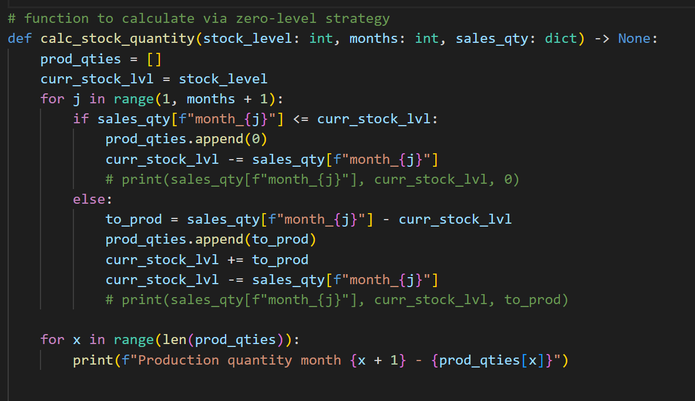
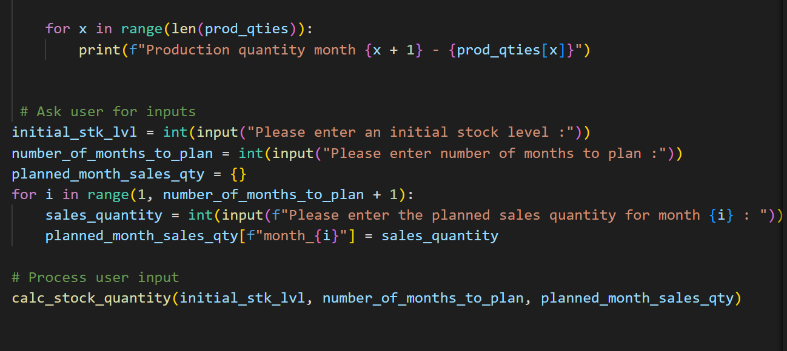
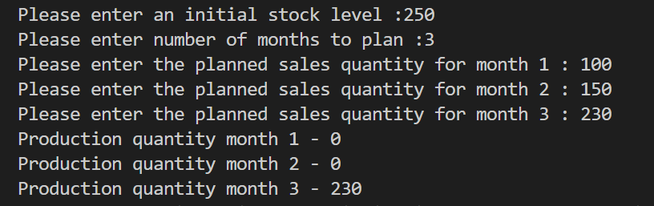

# production-planner

## Description
This project is done purposely to help estimate or plan how much production is needed each month using the zero-level-stock strategy:smile: :+1:.

## :bulb:What this project entails 

This model is aimed at avoiding products taking too long at the warehouse before delivering. 

# How it works

You will need to:
 
 :one: enter your initial (current) stock at hand.

 :two: enter the number of months you want to plan for.

 :three: enter the number of sales you expect to make for each month indicated above.

The model will then tell you when you will be expected to start production and how much to produce with the current stock in mind.

## Screenshots:camera: of codes:

&nbsp;

## Screenshot:camera: of results:

## Author

Edison Denutsui